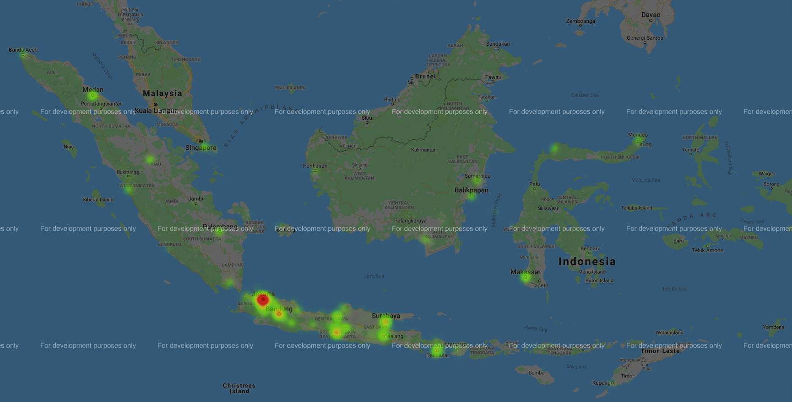

## Packages
- tweepy
- geopip
- pandas
- gmplot
- matplotlib
- numpy

## API Set
- in 01xx.py file : Twitter API Key
- in my_heatmapoutputxx.html file : Google Maps API Key

## Sample Output
sample heatmap.

